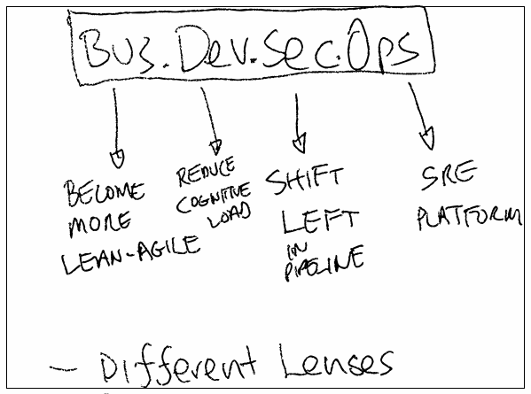

# BusDevSecOps

* Must approach Open Hybrid Cloud Adoption with different lenses
* Business adopts lean agile
* Governance & Policy
* Security & Compliance
* Self Service
* SRE (SLO/SLI, Error Budgets)
* Who runs the application in production?
    - Build It, Ship It, Run It - product team
    - SRE
    - Ops
    - Managed Outsource
