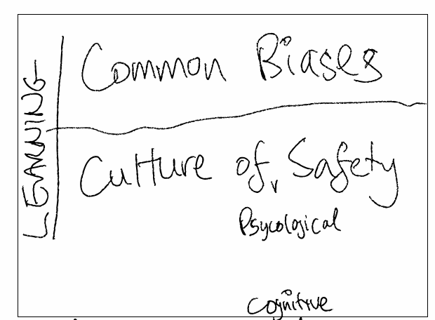

# Safety

* Recognize common cognitive biases
* Learn to adapt or live with them!
* Create a culture of psychological safety
* Teams must be able to safely Fail so they can learn
    - environments
    - retrospectives are actioned
    - blameless post mortems
