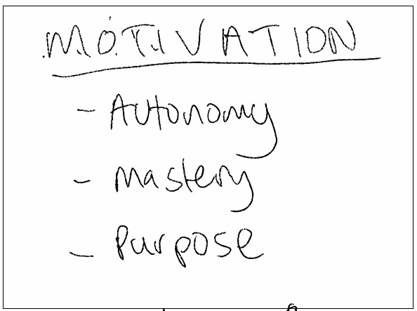

# Motivation

* Knowledge work is different to manual labour
* Once salary meets expectations, what motivates workers?
* The fourth revolution == Data and AIML
* Software has already eaten the world
