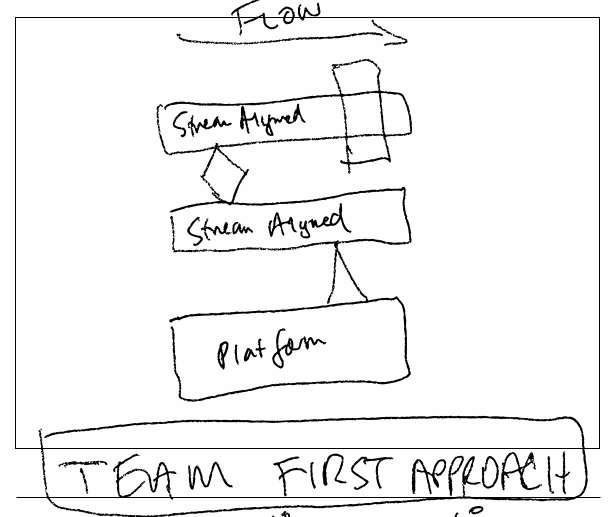

# Teams

* A team first approach is required
* Organize for success
* One Team, One Dream
* Teams are cross-functional
* Align around products
* Team types and interaction modes
* Reduce developer cognitive load (dev portals)
* Reverse Conway & Dunbar's Number
* Remove barriers to fast flow
* Lean thinking - optimize teams for flow, then utilization
